<p align="center">
  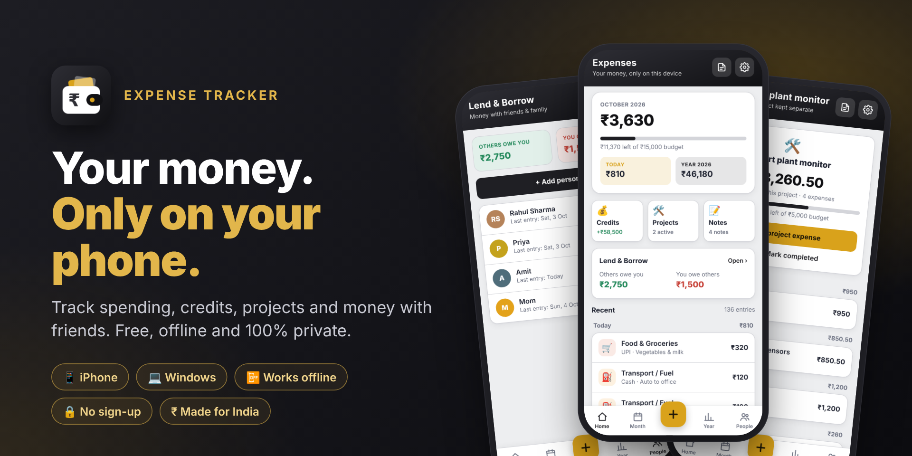
</p>

<h1 align="center">Expense Tracker</h1>

<p align="center">
  <b>A free and private money app for iPhone and Windows.</b><br>
  Track daily expenses, credits, projects and money with friends. Works offline. No sign-up.
</p>

<p align="center">
  
  
  
  
  
</p>

<p align="center">
  <a href="https://madhavlathigara.github.io/expense-app/"><b>👉 Open the app</b></a>
  &nbsp;·&nbsp; <a href="#-install">Install</a>
  &nbsp;·&nbsp; <a href="#-features">Features</a>
  &nbsp;·&nbsp; <a href="#-screenshots">Screenshots</a>
  &nbsp;·&nbsp; <a href="#-faq">FAQ</a>
</p>

---

## 💡 Why this app?

- 🔒 **100% private.** Your data is saved only on your own device. There is no account, no server, no ads and no tracking.
- 📴 **Works offline.** After the first open, it works without internet.
- 📱 **Installs like a real app.** It runs on iPhone and Windows. No App Store needed.
- ⚡ **Fast to use.** Add an expense in a few seconds: type the amount, tap a category, save.
- ₹ **Made for India.** It uses rupees, the Indian number format (₹1,00,000) and has UPI as a payment mode.

---

## ✨ Features

### 🧾 Daily expenses
- Add an expense with amount, category, payment mode (UPI, Cash, Card…), date and a note.
- Big category buttons, so you don't need to type the category.
- **Today** and **Yesterday** buttons, so you rarely need to pick a date.
- Tip on a computer: type `120+80` and it adds them for you.

### 📊 Month & year summary
- Monthly total, average per day and budget left.
- A chart of spending by day, plus breakdowns by category and by payment mode.
- A yearly view with all 12 months, a chart, and your highest month.

### 🎯 Budgets
- Set a monthly budget for each category.
- See how much is left. It turns red when you go over.

### 💰 Credits
- Record money that comes into your account.
- See **Credits**, **Spent** and **Left** for every month.
- Kept separate from your expenses.

### 🛠️ Projects
- Create a project, for example *"Smart plant monitor"*, with an optional budget.
- Add expenses inside the project: what it was for, how much, how you paid.
- Project expenses **stay inside the project**. They are not mixed with your daily spending.
- Mark a project as completed when it is done.

### 🤝 Lend & Borrow
- Add friends and family.
- Tap **I gave** or **I got** to record money given or received.
- See who owes you and whom you owe, at a glance.
- **Settle up** in one tap.

### 📝 Notes
- A simple notepad, like iPhone Notes.
- Saves while you type. Pin, search, share and delete notes.

### 🎨 Look & feel
- 4 colour themes: **Black & Gold**, **Royal Purple**, **Wine & Peach**, **Teal & Coral**.
- Automatic **dark mode**.
- Smooth animations: counting numbers, growing charts, confetti when you settle up. You can switch them off.

### 💾 Backup & export
- Save a backup file to iCloud Drive, OneDrive or anywhere else, and restore it later.
- Export expenses, credits, projects and lend/borrow to **CSV**, which opens in Excel.
- Export notes to a text file.

---

## 📸 Screenshots

<table>
  <tr>
    <td align="center">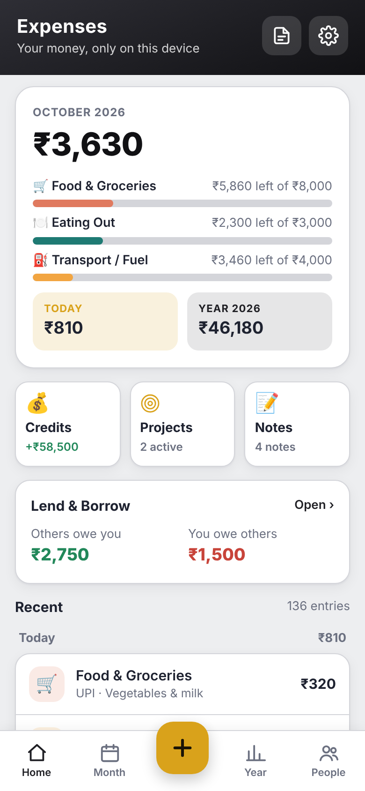<br><sub><b>Home</b></sub></td>
    <td align="center">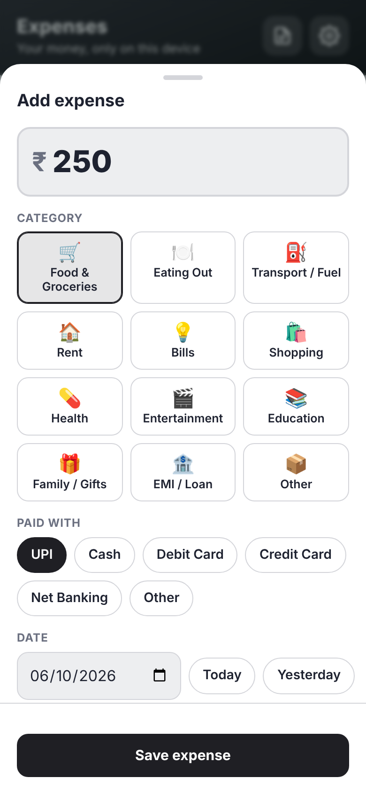<br><sub><b>Add an expense</b></sub></td>
    <td align="center">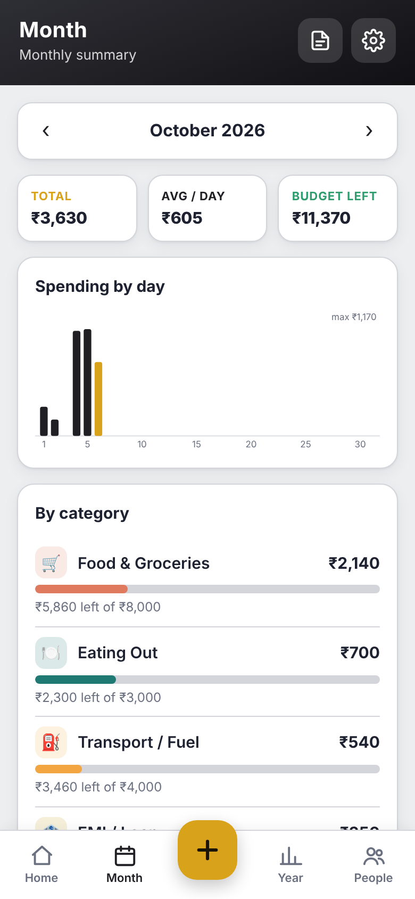<br><sub><b>Month summary</b></sub></td>
  </tr>
  <tr>
    <td align="center">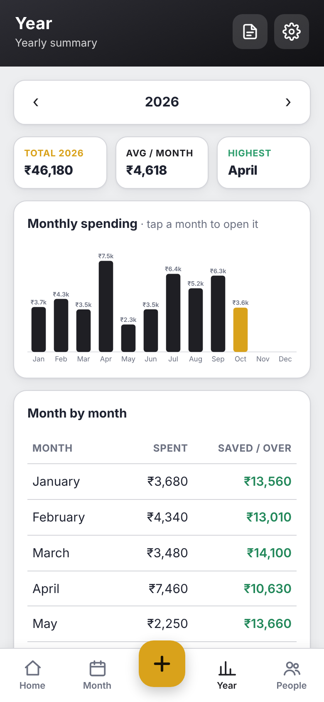<br><sub><b>Year summary</b></sub></td>
    <td align="center">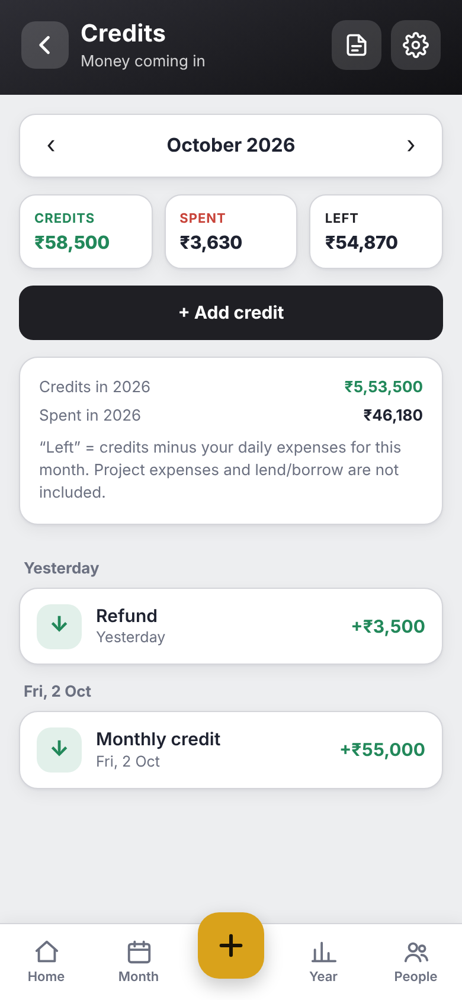<br><sub><b>Credits</b></sub></td>
    <td align="center">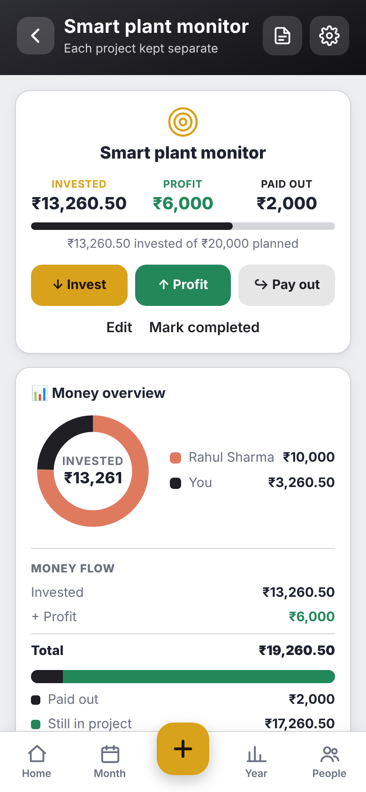<br><sub><b>A project</b></sub></td>
  </tr>
  <tr>
    <td align="center">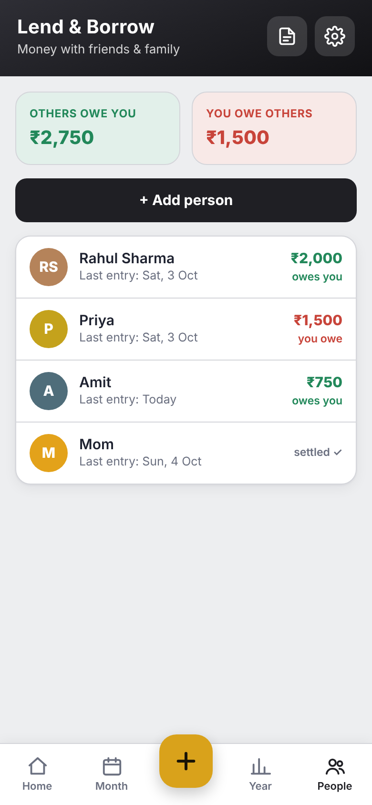<br><sub><b>Lend & Borrow</b></sub></td>
    <td align="center">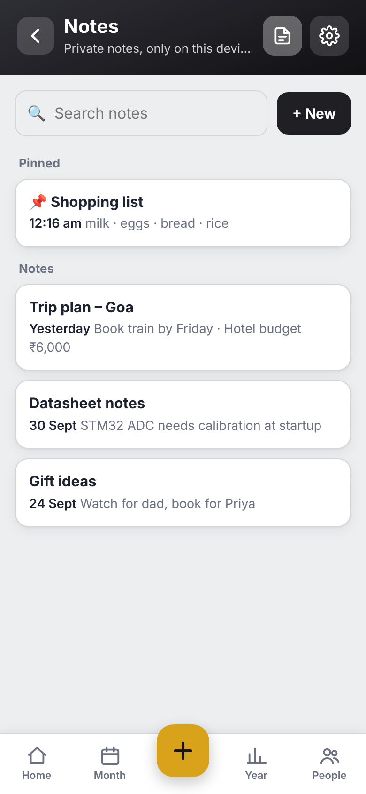<br><sub><b>Notes</b></sub></td>
    <td align="center">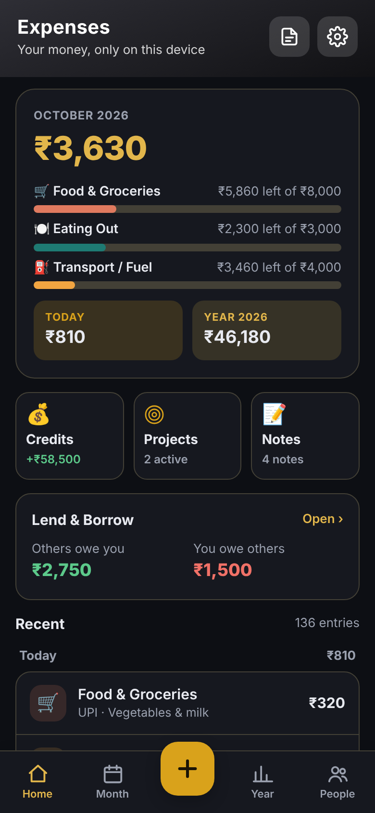<br><sub><b>Dark mode</b></sub></td>
  </tr>
</table>

<details>
<summary><b>More screenshots: other themes, settings, Windows</b></summary>
<br>
<table>
  <tr>
    <td align="center">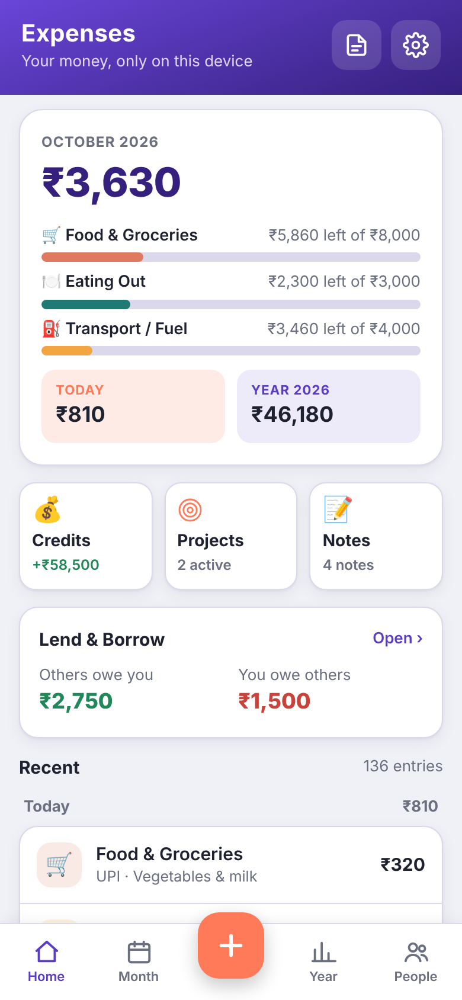<br><sub>Royal Purple</sub></td>
    <td align="center">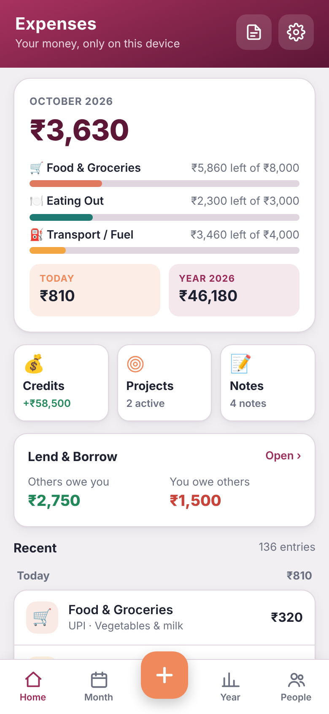<br><sub>Wine & Peach</sub></td>
    <td align="center">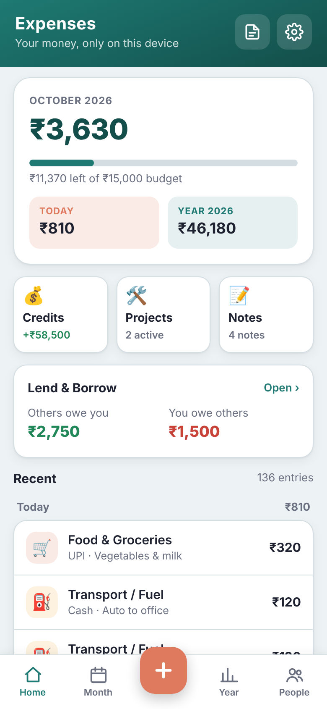<br><sub>Teal & Coral</sub></td>
    <td align="center">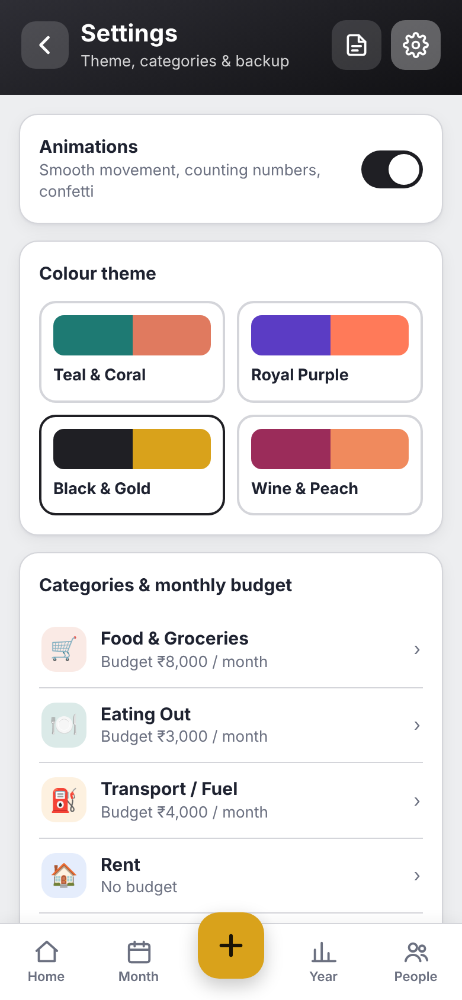<br><sub>Settings</sub></td>
  </tr>
</table>
<p align="center">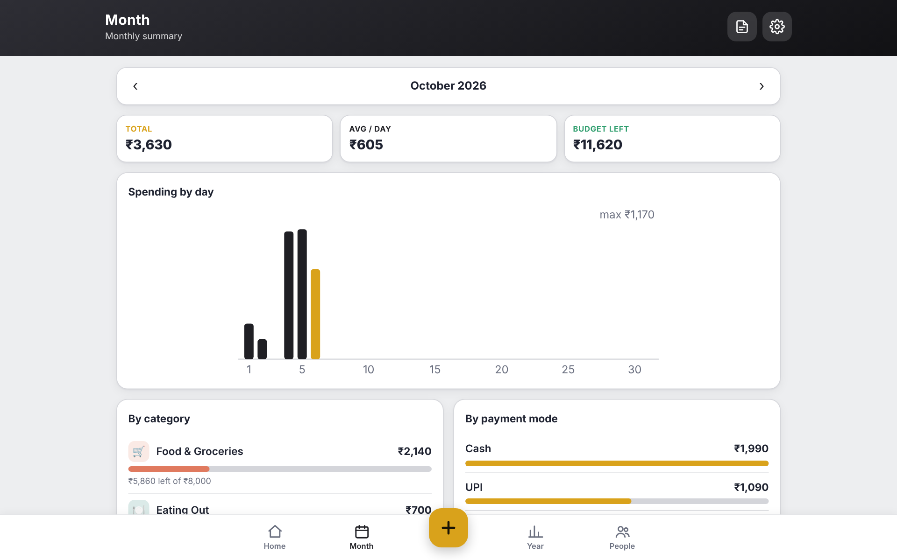<br><sub>On a Windows PC</sub></p>
</details>

---

## 📲 Install

You don't download this app from a store. You open a link and add it to your device. It takes about 30 seconds.

**App link:** https://madhavlathigara.github.io/expense-app/

### iPhone
1. Open **Safari** and go to **[madhavlathigara.github.io/expense-app](https://madhavlathigara.github.io/expense-app/)**.
   Make sure you see the black & gold **Expenses** app, **not** this GitHub page.
2. Tap the **Share** button (the square with an arrow). On newer iPhones it may be inside the **⋯** menu.
3. Scroll down and tap **Add to Home Screen**. If you see **Open as Web App**, keep it on. Then tap **Add**.
4. Open **Expenses** from your home screen. It opens full screen, like a normal app.

> 💡 If you open the link from WhatsApp, Instagram or the GitHub app, it may open inside that app's browser, where "Add to Home Screen" is missing. Open it in **Safari** instead.

### Windows
1. Open the link in **Microsoft Edge** (or Chrome).
2. Click the **Install** icon in the address bar.
   Or use **⋯ menu → Apps → Install this site as an app**.
3. The app gets its own window and a Start menu icon.

### Other devices
The app runs in any modern browser. On Android, open the link in Chrome and use **⋮ → Add to Home screen**. Android has not been fully tested yet.

---

## 🚀 Quick start

1. Tap the **+** button, type the amount, pick a category and save.
2. Open **Settings** (⚙️ top right) to set monthly budgets or change the colour theme.
3. Use the **Credits**, **Projects** and **Notes** tiles on Home for the side features.
4. Use the **People** tab for money you gave to or got from friends.
5. Save a **backup** about once a month.

---

## 🔐 Your data & privacy

- Everything you enter is saved **only on your device**, in the app's local storage.
- The app has **no server, no login, no analytics and no ads**. Your data is never sent anywhere.
- The website only delivers the app's code. If you share the link, each person gets their **own empty copy**. Nobody can see anyone else's data.
- Each device keeps its own data. iPhone and Windows do **not** sync with each other.
- ⚠️ If you delete the app or clear the browser's website data, your entries are deleted too. **Save a backup regularly.**
- The full source code is in this repository, so anyone can check what it does.

---

## 💾 Backup & restore

- **Backup:** Settings → **Save backup file**. On iPhone, choose *Save to Files* (for example, iCloud Drive).
- **Restore:** Settings → **Restore from backup file**, then pick your file.
  Restoring **replaces** the data on that device with the data from the file.
- **Moving to a new phone or PC:** make a backup on the old device, then restore it on the new one.

---

## ❓ FAQ

<details><summary><b>Is it really free?</b></summary><br>Yes. No ads, no subscription, no in-app purchases.</details>

<details><summary><b>Do I need to create an account?</b></summary><br>No. Open the link and start using it.</details>

<details><summary><b>Why is it not on the App Store?</b></summary><br>It is an installable web app (a "PWA"). It installs from the link, so no store is needed. It still gets its own icon and opens full screen.</details>

<details><summary><b>Does it work without internet?</b></summary><br>Yes. After you open it once, it works offline.</details>

<details><summary><b>Can I use it on my phone and my PC at the same time?</b></summary><br>Yes, but each device keeps its own separate data. To copy data from one device to another, use Backup and Restore. Note that Restore replaces the data on the device you restore to.</details>

<details><summary><b>How do I get updates?</b></summary><br>When a new version is published, open the app while you are online. Then close it and open it again. Your data stays.</details>

<details><summary><b>I deleted the app by mistake. Can I get my data back?</b></summary><br>Only if you saved a backup file. Install the app again and use <b>Restore from backup file</b>.</details>

---

## 🛠️ Built with

- Plain **HTML, CSS and JavaScript**. No frameworks, no external libraries, no tracking scripts.
- It is a **Progressive Web App (PWA)**: a web manifest makes it installable, and a service worker makes it work offline.
- Data is stored with the browser's `localStorage`. Money amounts are stored in paise (whole numbers) to avoid rounding errors.

```
expense-app/
├── index.html              # the whole app (screens, styles and logic)
├── manifest.webmanifest    # app name, icon and colours for installing
├── sw.js                   # offline support
├── icons/                  # app icons
└── screenshots/            # images used in this README
```

### Make your own copy
1. Click **Fork** at the top of this page.
2. In your copy, open **Settings → Pages**. Choose **Deploy from a branch**, then **main** and **/ (root)**, then **Save**.
3. After 1–2 minutes, your own link appears: `https://<your-username>.github.io/expense-app/`

---

## 🤝 Feedback

Found a bug or have an idea? Please open an [Issue](../../issues). Suggestions are welcome.

<p align="center"><sub>Made with ❤️ in India</sub></p>
